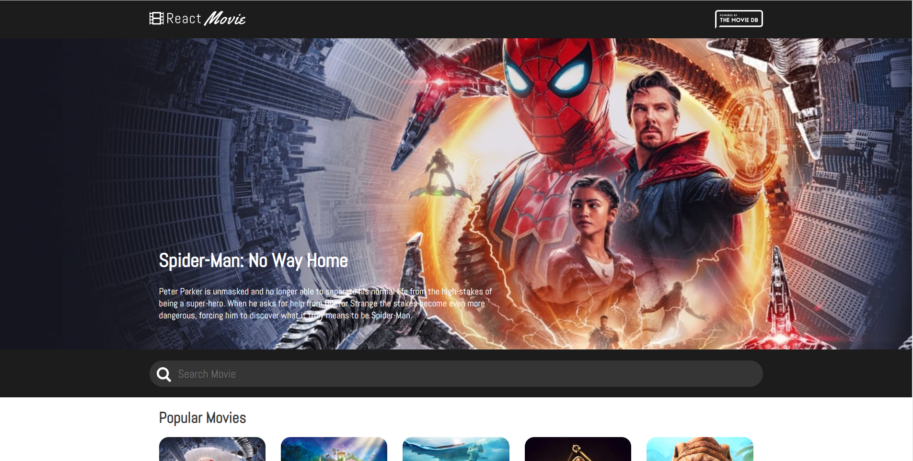
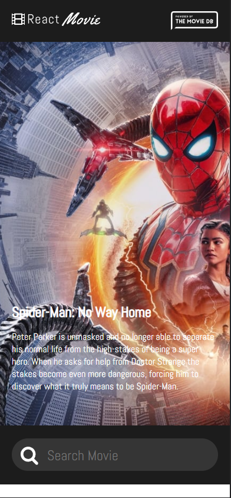
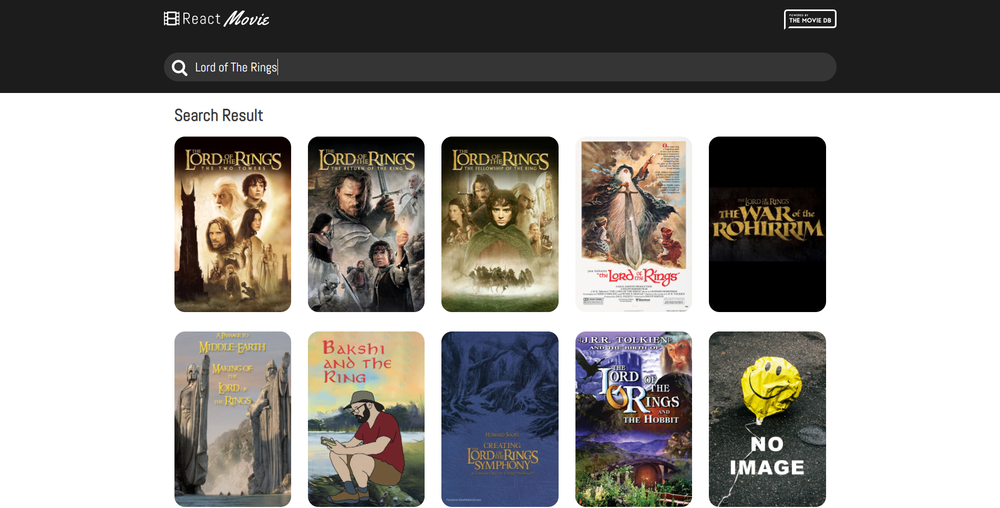

# Getting Started with Create React App

This project was bootstrapped with [Create React App](https://github.com/facebook/create-react-app).

Install project dependencies and configurations once you have project files:

###  `npm install` or `npm i`

In the project directory, you can run:

### `npm start`

# User View

## Desktop View

## Mobile View

## Searching a movie

